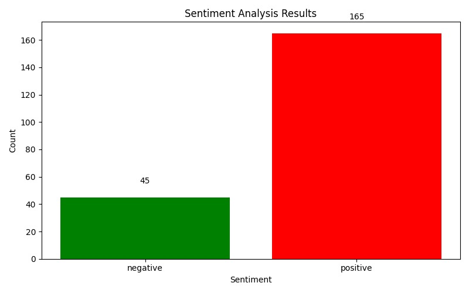

# 🗽 Sentiment and Engagement Analysis on New York Times Comments with Hadoop MapReduce 💬

This project explores user comments from *The New York Times*, focusing on **sentiment analysis** and **engagement trends**. The dataset contains **over 2 million comments**, enabling insights into reader opinions and interaction patterns on news articles.

## 📂 Project Files

- `ArticlesApril2017.csv` – 📁 Input CSV file with raw New York Times comments  
- `sentiment_lexicon.txt` – 📚 Combined lexicon used for sentiment classification  
- `positive-words.txt` – ➕ List of words associated with positive sentiment  
- `negative-words.txt` – ➖ List of words associated with negative sentiment  
- `SentimentMapper.java` – 🔄 Java MapReduce Mapper class  
- `SentimentReducer.java` – 🔢 Java MapReduce Reducer class  
- `SentimentAnalysisDriver.java` – 🚗 Driver class to run the MapReduce job  
- `nyt_output.txt` – 📄 Output result file fetched from HDFS  
- `analyze_sentiment.py` – 📊 Python script to visualize sentiment trends  
- `sentiment_summary.csv` – 📑 Summary CSV file of sentiment distribution  
- `sentiment_chart.png` – 🖼️ Bar chart showing sentiment analysis results  

---

## 🛠️ Environment Setup

> 📌 System: **Ubuntu 24.04.2** installed via **VirtualBox VM**

### ✅ Steps:

1. ☕ Install Java Development Kit (JDK)  
2. 👤 Create a new Hadoop user and configure passwordless SSH  
3. 📥 Download and extract Hadoop binaries  
4. ⚙️ Configure `core-site.xml`, `hdfs-site.xml`, `mapred-site.xml`, `yarn-site.xml`  
5. 💾 Format the HDFS NameNode:
   ```bash
   hdfs namenode -format
   ```
6. ▶️ Start Hadoop daemons:
   ```bash
   start-dfs.sh
   ```
7. 📟 Check daemons using:
   ```bash
   jps
   ```

---

## 📥 Dataset and Lexicon Preparation

1. 🌐 Download the dataset from Kaggle:  
   [New York Times Comments](https://www.kaggle.com/datasets/aashita/nyt-comments)

2. 🗃️ Use `ArticlesApril2017.csv` as input file  
3. 🧹 Create a clean version of the dataset if needed (e.g., `nyt_comments.txt`)  
4. 📑 Create sentiment lexicon files:
   - `positive-words.txt`
   - `negative-words.txt`
   - Or combine them into `sentiment_lexicon.txt`

---

## 🗂️ Upload Files to HDFS

```bash
hdfs dfs -mkdir -p /nyt_input
hdfs dfs -put nyt_comments.txt /nyt_input/
hdfs dfs -put sentiment_lexicon.txt /nyt_input/
```

Verify with:
```bash
hdfs dfs -ls /nyt_input
```

---

## 💻 Compile and Run Java MapReduce

### 1. 🧪 Compile Java files

```bash
javac -classpath `hadoop classpath` -d sentiment_classes SentimentMapper.java SentimentReducer.java SentimentAnalysisDriver.java
```

### 2. 📦 Create JAR

```bash
jar -cvf SentimentAnalysis.jar -C sentiment_classes/ .
```

### 3. 🏃 Run the MapReduce job

```bash
hadoop jar SentimentAnalysis.jar SentimentAnalysisDriver /nyt_input /nyt_output
```

### 4. 📥 Fetch output from HDFS

```bash
hdfs dfs -get /nyt_output/part-r-00000 nyt_output.txt
```

---

## 📊 Visualize Sentiment with Python

Make sure Python is installed along with required packages:

```bash
sudo apt install python3-pip
pip3 install --user pandas matplotlib nltk
```

Then run:

```bash
python3 analyze_sentiment.py
```

This will generate:
- `sentiment_summary.csv` → 📑 Contains sentiment class distribution  
- `sentiment_chart.png` → 📊 Visual chart of sentiment results  

---

## 🎉 Results Summary

The sentiment analysis of New York Times comments yielded the following insights:

- 🟢 **Positive comments**: 165
- 🔴 **Negative comments**: 45

The analysis indicates that a **majority of user comments were positive**, reflecting favorable engagement and sentiment toward the articles during the selected period.

The sentiment distribution is visually represented in the `sentiment_chart.png` file:




---

> 🧠 *This project demonstrates how traditional Java-based Hadoop MapReduce can be effectively used for large-scale sentiment analysis on real-world text data.*
